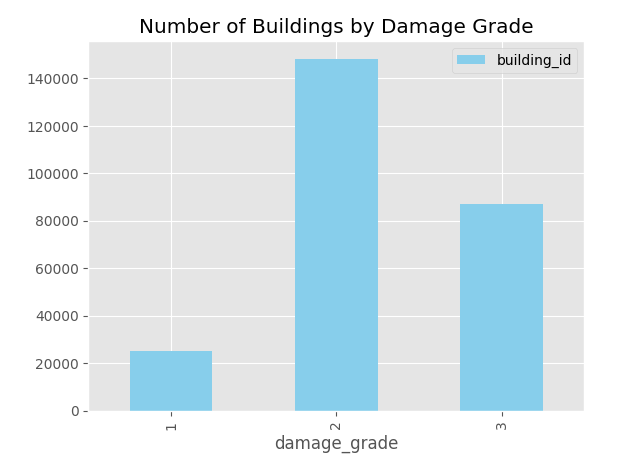
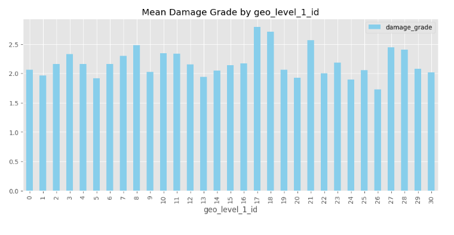

# Drivendata's Richter Predictor Competition

This project is a machine learning model that predicts the severity of earthquakes using the Richter Predictor Earthquake dataset from drivendata.org. The model is built using the Kedro framework and utilizes the CatBoostClassifier algorithm.

## Outcome
The final score (f1_micro) using the predefined parameters was ``74.51``


## Data Science Experiments
The goal of this competition is to predict damage (the target) to individual buildings (the rows). The dataset contains information about the **geographical location**, **building usage** and **building features** such as age, height, materials, etc.

### Analysis of the problem
This is a classification problem. After evaluating the dataset, I see two main challenges to overcome:
1. **Imbalance**: The class imbalance of the target variables. However, given that tree models aren't usually too bothered by this, we can ignore it.

2. **Cardinality**: There are three features that encode the geographical location of each building. Together, they contain over 12,000 categories, which makes encoding difficult. However, the geo_level columns have predictive power, since the location of a building and its proximity to the epicenter is a key factor. Therefore, this dataset is a category encoding problem.


### Method
- In order to build the best classifier, I started with a simple baseline model, a Random Forest Classifier that omits any non-numerical features.
- I then experimented with different encoding strategies and found that categorical encoding generally improved performance.
- This led me to employ the CatBoost model. After an extensive grid search with cross validation I found the best hyperparameters.

Here are the outcomes of the experiments:
| Experiment | Score |
| - | - |
| Simple baseline model without encodings | 0.652 |
| Random Forest with one hot encodings for ``geo_level_1_id`` | 0.660 |
| Random Forest with one hot endodings for ``geo_level_1_id`` and binary encoding for ``geo_level_2_id`` | 0.662 |
| Optimized CatBoost classifier | 0.745 |

## Installation

To run this project, you need to have Python and the Kedro framework installed. You can install the required dependencies by following these steps:

1. Clone this repository to your local machine.
2. Navigate to the project directory.
3. Create a virtual environment (optional but recommended): 
```bash
conda create -n [env_name] python=3.12
```
4. Activate the virtual environment:
```bash
conda activate [env_name]
```
5. Install the required dependencies: 
```bash
pip install -r requirements.txt`
```
6. Navigate to the parameters file
```bash
cd conf/base/parameters_data_science.yaml
```
7. Set ``finetune`` to ``True`` if you want to perform a grid search. ``False`` to run with the predefined parameters from ``predefined_params``. Adjust the predefined parameters or leave them as they  are.
6. Run the following command to execute the pipeline:
```bash
kedro run --pipeline __default__
```
7. Navigate to the model output folder and find the final predictions.
```bash
cd data/07_model_output
``` 
